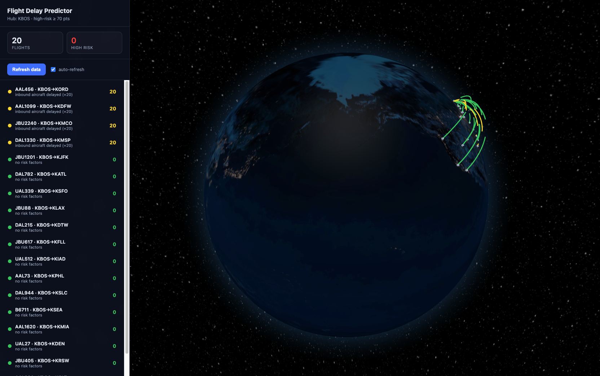

# Flight Delay Predictor

Predicts the **risk of departure delays** for upcoming flights by joining live
aviation weather forecasts with scheduled flight data, scoring each flight, and
storing predictions so they can later be compared against actual outcomes.

It flags a flight as **High Risk of Delay** *before* the airline officially
updates its status.



The dashboard renders each scored flight as an animated, risk-colored arc on a
rotating 3D globe (red = high risk of delay), with a live-updating sidebar.

## How it works

```
Flight data (mock, AeroAPI-shaped) ─┐
                                    ├─► join on (airport, departure hour) ─► risk scorer ─► predictions DB ─► API / console
NOAA TAF forecasts (live, no key) ──┘                                             │
                                                            (next day) backfill actual outcomes ─► /accuracy report
```

1. **Flight data** — three interchangeable providers behind one interface,
   selected automatically (AirLabs → OpenSky → mock) by which keys are set:
   - `AirLabsFlightProvider` (**recommended**) pulls real **scheduled**
     departures with delay status from the [AirLabs](https://airlabs.co/) API
     (`/schedules`). Free key, no credit card. Because it returns *future*
     schedules, flights are scored against the matching TAF forecast window.
   - `OpenSkyFlightProvider` pulls **real departures** from the
     [OpenSky Network](https://opensky-network.org/) via OAuth2. Its feed is
     batch-updated nightly, so it serves the most recent available real flights
     (often the prior day) rather than future schedules.
   - `MockFlightProvider` serves bundled sample departures across 10 US hubs
     (times relative to now) — the no-signup default.
2. **Weather data** — `NoaaWeatherClient` pulls **TAF** forecasts from the free,
   no-key [NOAA Aviation Weather Center API](https://aviationweather.gov/data/api/).
3. **TAF parsing** — `app/parsing/taf.py` selects the forecast segment(s)
   covering each flight's scheduled departure hour (handling `FM`/`TEMPO`/`PROB`
   overlays by worst case) and distills visibility, wind gusts, and severe
   weather.
4. **Risk scoring** — `RuleBasedScorer` applies a weight matrix:

   | Condition | Points |
   |---|---|
   | Visibility < 2 mi | +30 |
   | Wind gusts > 25 kt | +25 |
   | Thunderstorm / freezing precip in forecast | +40 |
   | Inbound aircraft already delayed (ripple effect) | +20 |

   Total ≥ **70** ⇒ flagged **High Risk**. The scorer is a pure function, so a
   `scikit-learn` model can replace it later without changing the pipeline.
5. **Persistence & accuracy** — predictions are stored in SQLite. The
   `actual_*` columns start empty; backfill them with real outcomes to compute
   precision/recall via `/accuracy`.

## Quickstart

```bash
python3 -m venv .venv
source .venv/bin/activate
pip install -r requirements.txt

# Console demo (fetches live KBOS weather, scores cached flights):
python -m app.pipeline

# Or run the API:
uvicorn app.main:app --reload
```

### API endpoints

| Method | Path | Purpose |
|---|---|---|
| `POST` | `/run?airport=KBOS` | Fetch, score, and persist predictions |
| `GET` | `/predictions?airport=KBOS` | All latest scored flights |
| `GET` | `/predictions/high-risk` | Only flights flagged high risk |
| `GET` | `/accuracy` | Precision/recall once actuals are backfilled |

### Live flight data

By default the app uses bundled sample flights (no signup). For real flights,
the recommended source is **AirLabs** (real scheduled departures + delay status):

1. Sign up free at [airlabs.co/signup](https://airlabs.co/signup) — no credit
   card, 1,000 requests/month.
2. Copy your API key from the dashboard.
3. Copy `.env.example` to `.env`, set `FDP_AIRLABS_API_KEY`, and restart.

The dashboard subtitle switches to **"Live flights (AirLabs)"**. AirLabs keys on
IATA codes; the app maps them to/from ICAO for weather + globe coordinates. Each
full 10-hub refresh uses ~10 requests (the auto-refresh poll reads the DB only).

OpenSky is also supported as an alternative — set `FDP_OPENSKY_CLIENT_ID` /
`FDP_OPENSKY_CLIENT_SECRET` instead (see `.env.example`).

## Configuration

All settings live in `app/config.py` and can be overridden with `FDP_`-prefixed
environment variables (e.g. `FDP_DEFAULT_AIRPORT=KSFO`,
`FDP_HIGH_RISK_THRESHOLD=60`, `FDP_FLIGHT_SOURCE=mock`).

## Tests

```bash
pytest
```

## Roadmap

- Add AeroAPI as a provider for true *future* scheduled departures.
- Implement the inbound-delay ("ripple effect") lookup via tail-number tracking.
- Add a backfill job that records actual delays the following day.
- Replace the rule-based scorer with a trained `scikit-learn` model.
